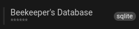

O Beekeeper Studio fornece um Modo Privacidade que oculta dados sensíveis quando você está compartilhando sua tela, para que possa manter informações privadas privadas.

## Interação

Enquanto paira sobre a Barra Lateral, você pode ver o botão "Toggle Privacy Mode", representado com um olho.
Clicar neste botão alternará o Modo Privacidade Ligado/Desligado.

| Modo Privacidade Desligado | Modo Privacidade Ligado |
| - | - |
|| |
| Fig.1 Botão Desligado | Fig.2 Botão Ligado |

## O que Fica Oculto?

O Modo Privacidade oculta alguns campos que podem ser considerados como sensíveis:
- Host / Porta / DB em Conexões Salvas
- Pop-up com a URL completa ao Pairar
- Host / Porta / DB em Configurações de Conexão
- URL ao pairar sobre o nome do DB após conectar

| Host / Porta / DB Ocultos em Conexões Salvas | O pop-up com a URL completa ao Pairar |
|-|-|
| | |
| Fig.3 - Funcionalidade Oculta 1 | Fig.4 - Funcionalidade Oculta 2 |

| Host / Porta / DB em Configurações de Conexão |  URL ao pairar sobre o nome do DB após conectar |
| - | - |
| |  |
| Fig.5 - Funcionalidade Oculta 3 | Fig.6 - Funcionalidade Oculta 4 |