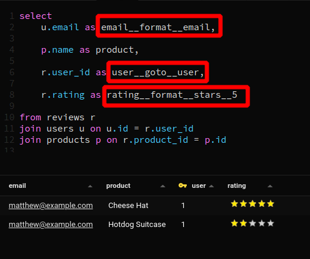
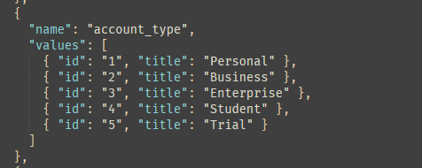
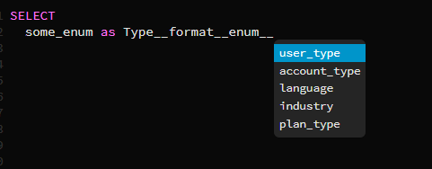
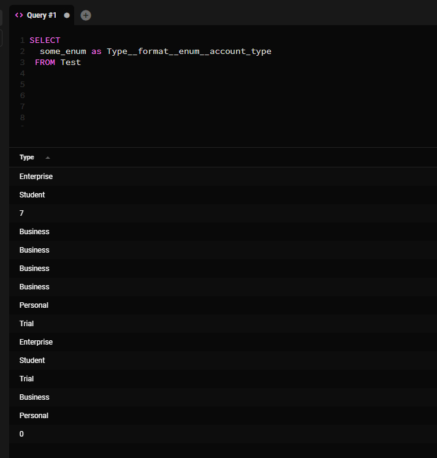

Aqui hay un recorrido rapido sobre como usar Query Magics.
<iframe width="100%" height="400" src="https://www.youtube-nocookie.com/embed/27xYE423Xqw" title="YouTube video player" frameborder="0" allow="accelerometer; autoplay; clipboard-write; encrypted-media; gyroscope; picture-in-picture" allowfullscreen></iframe>

<br/>


## Usa Query Magics para

- Vincular a otra tabla
- Hacer URLs clicables
- Hacer direcciones de email clicables
- Mostrar una URL como imagen
- Mostrar un numero como calificacion de estrellas
- Mostrar un numero como barra de progreso
- Mostrar un numero como dinero localizado

## Como usar Query Magics

Puedes formatear los resultados de una consulta SQL simplemente agregando algo de texto al final de los nombres de tus columnas.

Por ejemplo, para formatear el campo `url` como un enlace harias esto:

```sql
select url as url__format__link from some_table
```

Aqui hay un ejemplo rapido que muestra emails clicables, enlaces a otra tabla y renderiza un numero como calificacion de estrellas.





## Query Magics disponibles

En todas las descripciones a continuacion, el texto entre corchetes es opcional.


### Reemplazar valores con un enum personalizado

Reemplaza los valores en una columna basandose en enums definidos por el usuario.

Los enums se definen en un archivo llamado `enums.json`, que se encuentra en el directorio userData.

Ubicaciones del directorio userData:

- Windows: `%APPDATA%\beekeeper-studio`
- Linux: `~/.config/beekeeper-studio`
- MacOS: `~/Library/Application Support/beekeeper-studio`

Crea un archivo `enums.json` en ese directorio con el formato a continuacion:

```json
  [
    {
      "name": "user_type",
      "variants": [
        { "id": "1", "value": "Default" },
        { "id": "2", "value": "Admin" },
        { "id": "3", "value": "Editor" },
        { "id": "4", "value": "Viewer" },
        { "id": "5", "value": "Guest" }
      ]
    },
    {
      "name": "account_type",
      "variants": [
        { "id": "1", "value": "Personal" },
        { "id": "2", "value": "Business" },
        { "id": "3", "value": "Enterprise" },
        { "id": "4", "value": "Student" },
        { "id": "5", "value": "Trial" }
      ]
    },
  ]
```

Al seleccionar columnas en tu consulta, usa el siguiente formato QueryMagic

```
select a as  columnname__format__enum__enumname

 --ejemplos
select
  user as user__format__enum__user_type,
  account_id as account__format__enum__account_type
```
En tu tabla de resultados esto reemplazara `id` con `value`. Entonces en el ejemplo final, reemplazara todos los valores donde account_id es `1` con `"Personal"`

Aqui estan los enums en accion:







### Formatear como enlace clicable

Hacer URLs clicables

```
columnname__format__link`
```

### Formatear como direccion de email clicable

Similar a los enlaces, hace los emails clicables - esto abrira una ventana de redaccion en tu cliente de email predeterminado.

```
columname__format__email`
```

### Formatear como check/tick
Muestra un check o cruz - 1 para check, 0 para cruz. No hay mas opciones

```
columname__format__check
```

### Formatear como imagen (img)

Toma una URL y la muestra como imagen. Puedes cambiar el ancho y alto si lo deseas.


```sql
columname__format__image[__width[__height]]

--ejemplos
columname__format__image -- predeterminado
columname__format__image__50 -- establece ancho a 50
columnname__format__image__50__100 -- establece ancho a 50, alto 100
```

### Formatear como dinero
Muestra un numero en una moneda especifica, por defecto USD.

```sql
columname__format__money[__currencyCode]
--ejemplos
columname__format__money      -- USD (predeterminado)
columname__format__money__gbp -- Libra britanica
columname__format__money__cop -- Peso colombiano

```

### Formatear como barra de progreso

Muestra un numero como barra de progreso, por defecto esto asume un rango de 0 - 100.

```sql
columnname__format__progress[__max]
-- ejemplos
columname__format__progress -- predeterminado 0-100
columname__format__progress_10 -- el rango es 0-10

```


### Formatear como calificacion de estrellas

Muestra un numero como calificacion de estrellas (como encontrarias en un sitio de resenas). El predeterminado asume una calificacion de 0-5 estrellas.

```sql
columname__format__stars[__max]
--ejemplos
columname__format__stars__10 -- 0-10 estrellas

```

### Vincular a otra tabla (goto)

Esta magia te permite vincular a otras tablas basandote en el valor en tu conjunto de resultados, tal como funcionan los enlaces de clave foranea en la vista de datos de tabla.

Tu enlace de tabla puede opcionalmente incluir un filtro de columna.

```sql
columname__goto[__schema]__table[__column] -- sintaxis
--ejemplos
columname__goto__users -- enlace a la clave primaria de la tabla users
columname__goto__public__users -- enlace a la clave primaria de la tabla users en el esquema public
columname__goto__products__user_id -- enlace a la tabla products, filtrar por user_id
```

Porque puedes proporcionar un filtro, puedes usar esto para mas que enlaces de clave foranea. Por ejemplo, podrias vincular a todos los productos comprados por un usuario especifico.
