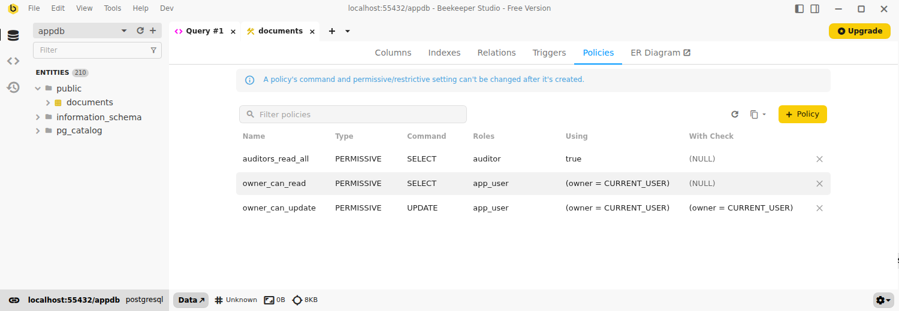
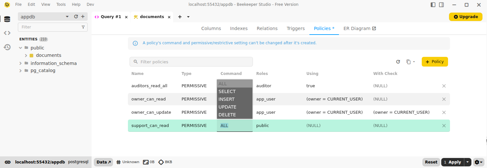
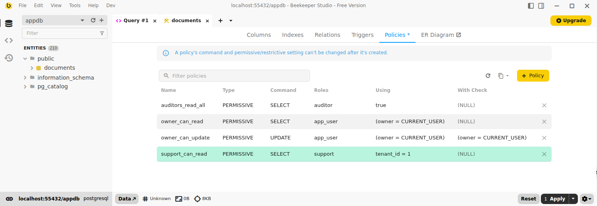
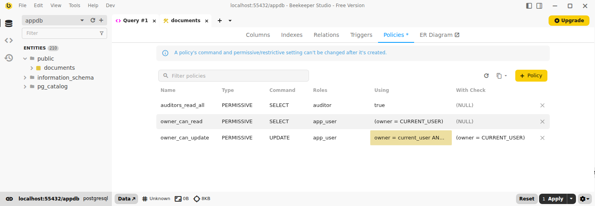
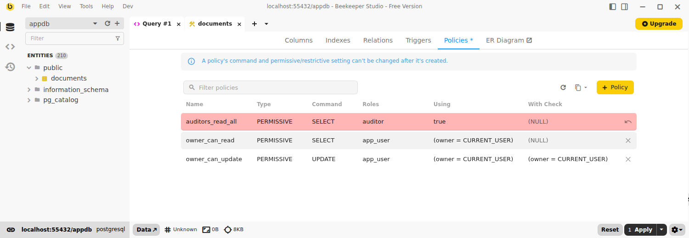
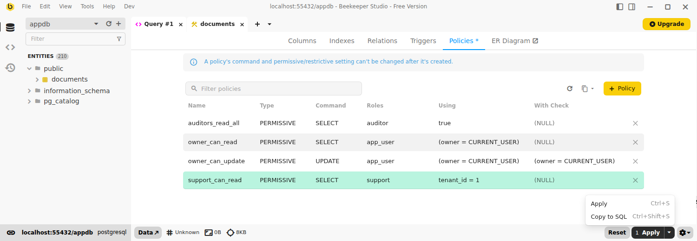
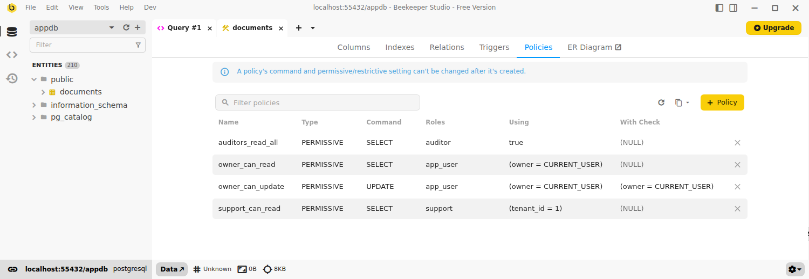
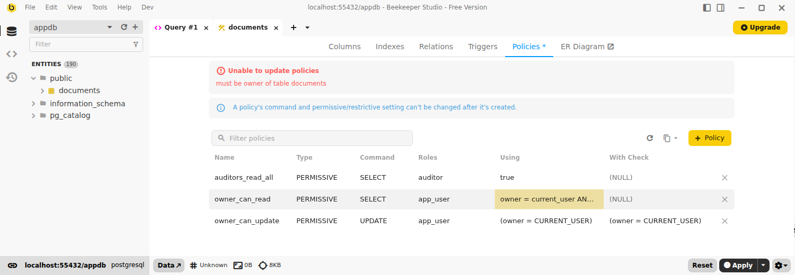

Postgres can restrict which rows a role is allowed to read or write using [row level security](https://www.postgresql.org/docs/current/ddl-rowsecurity.html) policies. Beekeeper Studio gives those policies their own tab in the table structure view, so you can manage them without writing `CREATE POLICY` by hand.

Right click a table in the sidebar, click `View Structure`, then open the **Policies** tab.



!!! note
    The Policies tab appears for **Postgres 9.5 and above**, which is where row level security was introduced. It is hidden for other databases, and for CockroachDB and Redshift, whose row level security works differently.

## What each column means

| Column | Description |
| --- | --- |
| **Name** | The policy name, unique per table. |
| **Type** | `PERMISSIVE` policies are combined with `OR` — a row passes if any one of them allows it. `RESTRICTIVE` policies are combined with `AND` — every one of them must allow it. |
| **Command** | The statement the policy applies to: `ALL`, `SELECT`, `INSERT`, `UPDATE`, or `DELETE`. |
| **Roles** | The roles the policy applies to, comma separated. `public` means every role. |
| **Using** | The expression that decides which existing rows the role can see or change. |
| **With Check** | The expression that decides which new or updated rows the role is allowed to write. |

`INSERT` policies only take a `With Check` expression, and `SELECT` and `DELETE` policies only take a `Using` expression. Postgres reports an error if you set the wrong one.

Like the other structure tabs, you can filter the list with the search box and copy the whole grid as Markdown, CSV, or JSON from the copy button.

!!! warning "Policies do nothing until row level security is on"
    A table can have policies while row level security is still switched off, in which case Postgres ignores them entirely. Turn it on with:

    ```sql
    ALTER TABLE my_table ENABLE ROW LEVEL SECURITY;
    ```

## Adding a policy

Click `+ Policy` to add a row, then fill it in. New policies default to `PERMISSIVE`, `ALL`, and the `public` role.

**Type** and **Command** are dropdowns while the row is a pending insert:



Enter the roles as a comma separated list, and the expressions as plain SQL — the same text you'd put inside `USING (...)` and `WITH CHECK (...)`.



## Editing a policy

Double click any of **Name**, **Roles**, **Using**, or **With Check** on an existing policy to change it. Edited cells are highlighted until you apply them.



**Type** and **Command** become read-only once a policy exists, because Postgres has no syntax for changing them. To change either one, delete the policy and add a new one with the same name — both happen in a single `Apply`, so the policy is never missing in between.

Postgres also has no way to *remove* a `Using` or `With Check` expression from an existing policy. Clearing one is rejected before any SQL runs; delete and re-add the policy instead.

## Deleting a policy

Click the trash button at the end of a row. The row is marked for deletion and stays that way until you apply — click the undo arrow to keep it after all.



## Applying your changes

Pending adds, edits, and deletes stack up until you click `Apply` (`Ctrl+S`). `Reset` throws them all away.



Choose `Copy to SQL` (`Ctrl+Shift+S`) from the dropdown instead to open the generated `CREATE POLICY`, `ALTER POLICY`, and `DROP POLICY` statements in a new query tab, so you can review or edit them before running anything.

Everything applies as a single statement batch, so if one change fails, none of them are made.



## Permissions

Viewing policies requires no special privileges. **Changing** them requires you to own the table (or be a superuser) — the same rule Postgres applies to `CREATE POLICY`, `ALTER POLICY`, and `DROP POLICY`.

If your role isn't allowed, the error from Postgres is shown in the tab and your pending changes are kept, so you can reconnect as another role and apply them again.


