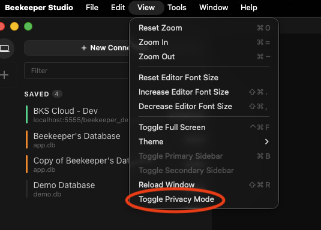
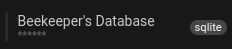
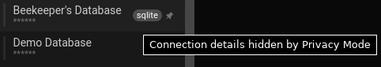
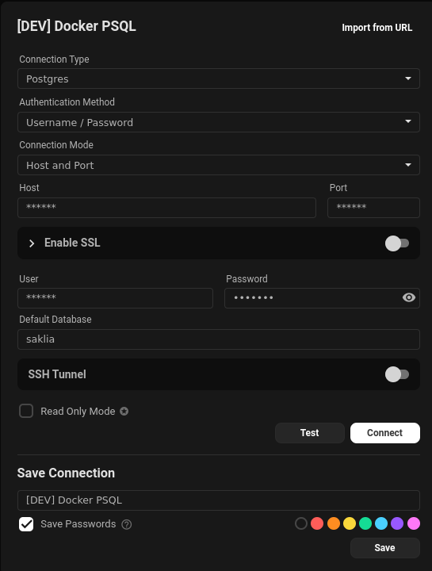
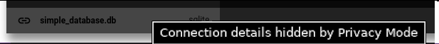

## Our Security Approach

Beekeeper Studio is a **desktop application** - the vast majority of your sensitive data never touches our servers.

- **Database credentials** are stored locally on your device and are never sent to us.
- **SQL queries** run directly from your machine to your database. We never see them.
- **Query results** are fetched directly to your device. We never process or store them.
- **Telemetry is opt-in only**. No query content, database data, or connection details are ever collected.

### Cloud Services Are Optional

Beekeeper Studio's cloud services (account management, billing, and workspace sync) are entirely optional. If you don't use cloud workspaces, no query or connection data ever reaches our infrastructure. When you do use cloud workspaces, sensitive fields like saved passwords are application-encrypted before being stored.

All cloud features can be disabled for environments with strict security postures - Beekeeper Studio works fully offline, including offline license validation. See the [Configuration docs](./configuration.md) for details on disabling cloud features via administrator configuration.

### Trust Center

For a full overview of our security practices, policies, and compliance posture, visit our [Trust & Security Center](https://www.beekeeperstudio.io/trust/).

---

## Security Features

Beekeeper offers several features designed to help you manage the privacy of your session, secure your environment, or enforce security settings for all users.

## Security Settings

Beekeeper Studio has several security settings



### PIN Lock Mode

Enabling PIN lock mode requires any Beekeeper Studio user to enter a pin code before connecting to a database. Combine this setting with auto disconnect for extra security.

!!! warning "Don't forget your PIN"
    If you forget your PIN, the only way to recover it is by deleting your local installation, or disabling PIN mode entirely.

#### Reset Steps (if you forget your pin)

1. **Close Beekeeper Studio completely**

2. **Delete the application data directory**:
   - **Windows**: `%APPDATA%\beekeeper-studio\`
   - **macOS**: `~/Library/Application Support/beekeeper-studio/`
   - **Linux**: `~/.config/beekeeper-studio/`

3. **Restart Beekeeper Studio** - it will start fresh with default settings

### Enterprise Security Recommendations

To enforce security settings on all Beekeeper Studio users you can deploy an administrator configuration file (`system.config.ini`) (see [Configuration docs](./configuration.md) for reference)

1. Create an ini file
2. enable `lockMode = pin`.
3. Enable all 3 auto-disconnect options with reasonable timeouts
4. Deploy this config file to the 'administrator configuration' location for your OS (see above)

This forces all users to set a PIN on first load of the app, requires pin entry when connecting to a database, and disconnects users when their system is locked, suspended, or idle.

## Privacy Mode

Beekeeper Studio provides a Privacy Mode that hides sensitive data when you're sharing your screen, so you can keep private information private.

Go to View in the app menu and select the option to "Toggle Privacy Mode".

### What Gets Hidden?

Privacy Mode hides some fields that might be considered as sensitive:
- Host / Port / DB in Saved Connections
- Pop-up with the full URL on Hover
- Host / Port / DB in Connection Settings
- URL when hovering over the DB name after connecting

| Hidden Host / Port / DB in Saved Connections | The pop-up with the full URL on Hover |
|-|-|
| | |
| Fig.3 - Hidden Feature 1 | Fig.4 - Hidden Feature 2 |

| Host / Port / DB in Connection Settings |  URL when hovering over the DB name after connecting |
| - | - |
| |  |
| Fig.5 - Hidden Feature 3 | Fig.6 - Hidden Feature 4 |

