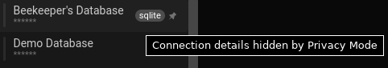
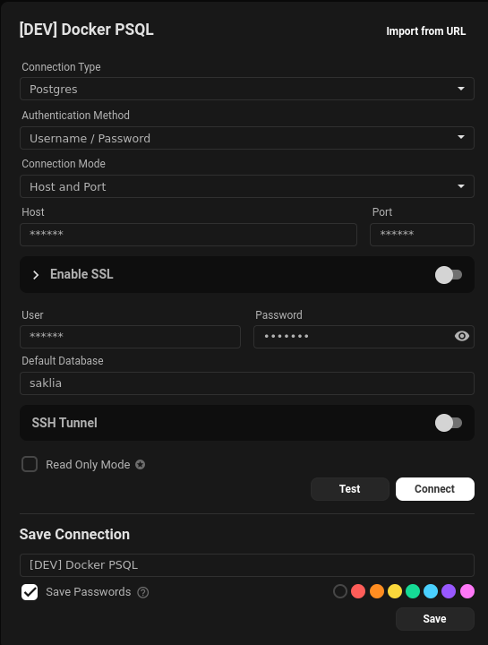
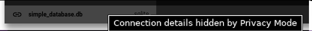

O Beekeeper oferece vários recursos projetados para ajudá-lo a gerenciar a privacidade da sua sessão, proteger seu ambiente, ou impor configurações de segurança para todos os usuários.

## Configurações de Segurança

O Beekeeper Studio tem várias configurações de segurança



### Modo de Bloqueio PIN

Habilitar o modo de bloqueio PIN requer que qualquer usuário do Beekeeper Studio insira um código pin antes de conectar a um banco de dados. Combine esta configuração com desconexão automática para segurança extra.

!!! warning "Não esqueça seu PIN"
    Se você esquecer seu PIN, a única forma de recuperá-lo é deletando sua instalação local, ou desabilitando o modo PIN inteiramente.

#### Passos de Reset (se você esquecer seu pin)

1. **Feche o Beekeeper Studio completamente**

2. **Delete o diretório de dados da aplicação**:
   - **Windows**: `%APPDATA%\beekeeper-studio\`
   - **macOS**: `~/Library/Application Support/beekeeper-studio/`
   - **Linux**: `~/.config/beekeeper-studio/`

3. **Reinicie o Beekeeper Studio** - ele iniciará novo com configurações padrão

### Recomendações de Segurança Enterprise

Para impor configurações de segurança em todos os usuários do Beekeeper Studio você pode implementar um arquivo de configuração de administrador (`system.config.ini`) (veja [docs de Configuração](./configuration.md) para referência)

1. Crie um arquivo ini
2. habilite `lockMode = pin`.
3. Habilite todas as 3 opções de auto-desconexão com timeouts razoáveis
4. Implemente este arquivo de configuração na localização 'configuração de administrador' para seu SO (veja acima)

Isso força todos os usuários a definirem um PIN no primeiro carregamento do app, requer entrada de pin ao conectar a um banco de dados, e desconecta usuários quando seu sistema está bloqueado, suspenso, ou ocioso.

## Modo Privacidade

O Beekeeper Studio fornece um Modo Privacidade que oculta dados sensíveis quando você está compartilhando sua tela, para que possa manter informações privadas privadas.

Enquanto paira sobre a Barra Lateral, você pode ver o botão "Toggle Privacy Mode", representado com um olho.
Clicar neste botão alternará o Modo Privacidade Ligado/Desligado.

| Modo Privacidade Desligado | Modo Privacidade Ligado |
| - | - |
|| |
| Fig.1 Botão Desligado | Fig.2 Botão Ligado |

### O que Fica Oculto?

O Modo Privacidade oculta alguns campos que podem ser considerados como sensíveis:
- Host / Porta / DB em Conexões Salvas
- Pop-up com a URL completa ao Pairar
- Host / Porta / DB em Configurações de Conexão
- URL ao pairar sobre o nome do DB após conectar

| Host / Porta / DB Ocultos em Conexões Salvas | O pop-up com a URL completa ao Pairar |
|-|-|
| | |
| Fig.3 - Funcionalidade Oculta 1 | Fig.4 - Funcionalidade Oculta 2 |

| Host / Porta / DB em Configurações de Conexão |  URL ao pairar sobre o nome do DB após conectar |
| - | - |
| |  |
| Fig.5 - Funcionalidade Oculta 3 | Fig.6 - Funcionalidade Oculta 4 |