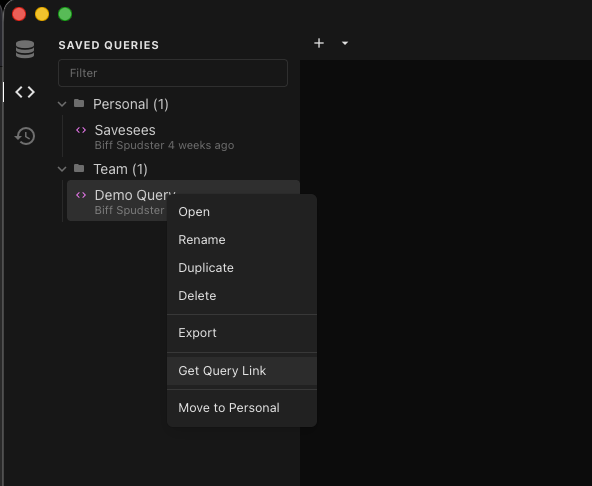
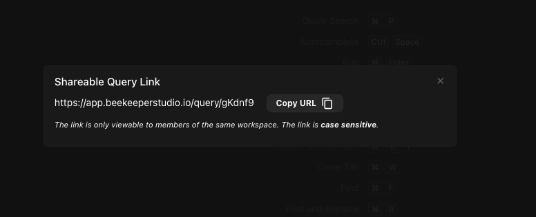
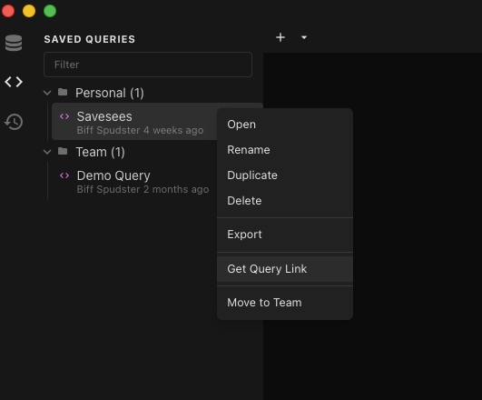
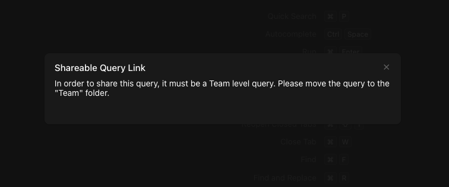
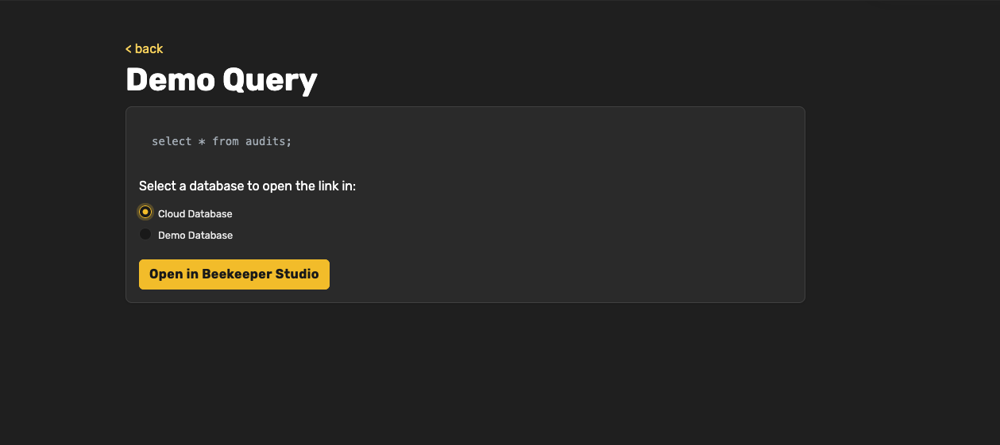

Users with workspaces today have the ability to share queries among each other. With this feature, a link can be generated for each shared query to add to your team's documentation, FAQs, etc. Give your team the notes they need for what the query does, how to use it, and more importantly, when to use it.

Members of your workspace will be able to view the query online and then will be able to open the query in their Beekeeper Studio application in the database it needs to be run.

## Getting the Link

Start by selecting a query that is in the **Team** folder. Right click the query and select **Get Query Link**. A modal will open with the link to add to your documentation.

*Note: The URL is case sensitive*

Queries that are in your **Personal** folder are not shareable.

## View Query in Cloud Workspace

A logged in user will be able to see the query in their cloud workspace and can select which database available to them in the workspace to open the query.
