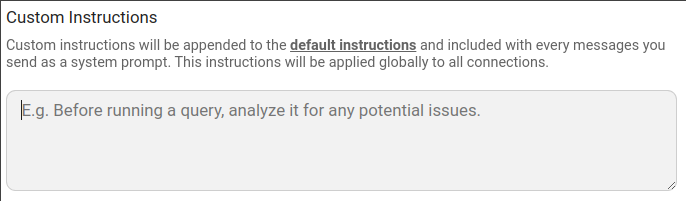

El AI Shell de Beekeeper Studio esta modelado segun [Claude Code](https://www.anthropic.com/claude-code) y [Aider](https://aider.chat/). Esta disenado para aumentar la productividad de usuarios tecnicos (como tu!).


## Programacion profunda y autoaprendizaje de IA

El AI Shell integra tu agente directamente dentro de Beekeeper Studio. Tiene profundo conocimiento de SQL y la capacidad de explorar esquemas, entender relaciones y restricciones, y escribir y ejecutar SQL (con permiso), directamente dentro de la aplicacion.

[Visita nuestro sitio web](https://beekeeperstudio.io/features/ai-sql) para videos, capturas de pantalla y mas.

## Como usar el AI Shell

1. Elige tu proveedor de IA preferido (en beta solo Anthropic esta disponible)
2. Ingresa tu clave API
3. Haz preguntas
4. La IA explora tus datos
5. Obtiene resultados
6. Haz mas preguntas

## Precios del AI Shell

El AI Shell **esta incluido en todas las versiones de pago de Beekeeper Studio**, sin cargo adicional. Ten en cuenta que eres responsable de los costos incurridos con tu proveedor de IA, ya que Beekeeper no actua como intermediario de ninguna manera.

Todas las descargas de Beekeeper Studio vienen con una prueba gratuita de 14 dias, [descarga Beekeeper Studio](https://beekeeperstudio.io/get) para probar el AI Shell ahora mismo.

## Herramientas del AI Shell

Tu agente de IA tiene acceso a las siguientes herramientas desde dentro de Beekeeper Studio:

- [x] Listar esquemas, tablas, vistas, funciones y procedimientos
- [x] Ver relaciones y restricciones de tablas
- [x] Revisar tus consultas guardadas para orientacion
- [x] Verificar tus pestanas abiertas para orientacion
- [x] Escribir y ejecutar SQL (con permiso)


## Configuracion del AI Shell

Puedes configurar el AI Shell usando el [sistema de configuracion](./configuration.md) de Beekeeper Studio.



## Instrucciones personalizadas

Puedes proporcionar instrucciones personalizadas para personalizar como el AI Shell responde a tus mensajes. Para agregar instrucciones personalizadas:

1. Abre el menu de configuracion (engranaje).
2. Ve a la pestana General.
3. Agrega tus instrucciones personalizadas en el campo de texto proporcionado

Tus instrucciones se agregan a las instrucciones base del AI Shell y se incluyen con **cada mensaje que envias** como un prompt del sistema, asegurando un comportamiento consistente entre sesiones.
Para detalles, consulta [el repositorio de instrucciones](https://github.com/beekeeper-studio/bks-ai-shell/tree/main/instructions).



## Privacidad de datos del AI Shell

El AI shell es 100% opcional. Incluso cuando esta en uso, ningun dato se envia desde el AI Shell a los servidores de Beekeeper Studio. El AI Shell se comunica directamente con tu agente de IA elegido -- sin intermediarios.

Para comenzar a usar el AI Shell debes elegir tu agente e ingresar una clave API. Al hacerlo, estas permitiendo que el AI Shell de Beekeeper Studio se comunique con tu agente de IA elegido.

### Informacion compartida con el agente

El AI Shell permite que tu agente explore el esquema de tus datos, ejecute SQL y lea resultados. El AI Shell te mostrara lo que la IA ve mientras trabaja, nada esta oculto de la vista.

El AI shell enviara la siguiente informacion a tu agente cuando uses el shell:

- Nombres de tablas y nombres de columnas
- Estructura de tabla, como relaciones e indices
- Consultas SQL ejecutadas previamente
- Los resultados de consultas SQL aprobadas para ejecucion (por ti) dentro del AI Shell
- Cualquier error de ejecucion de consulta que ocurra


### El AI Shell pide permiso para ejecutar SQL

El AI Shell puede ejecutar consultas SQL y luego ver los resultados de esas consultas. Esta es una parte clave de como el shell navega por tu base de datos para descubrir cosas.

Hay algunas acciones limitadas que el AI shell puede tomar sin tu permiso, pero siempre pedira tu consentimiento explicito al ejecutar SQL. Esto te da la oportunidad de revisar el codigo y rechazarlo cuando tengas preocupaciones.


#### Permitir ejecucion de consultas de solo lectura sin pedir permiso

Si prefieres que no se te pregunte cada vez, puedes habilitar `Siempre permitir ejecucion de consultas de solo lectura`:

1. Abre el menu de Configuracion (engranaje en el AI Shell).
2. Ve a la pestana General.
3. Activa **Siempre permitir ejecucion de consultas de solo lectura**.

### Deshabilitar el AI Shell

Puedes deshabilitar el AI shell completamente agregando un flag a tu [archivo de configuracion](./configuration.md) personal o de administrador para deshabilitar el shell.



Incluso si el usuario de la aplicacion ha ingresado previamente una clave API, esta configuracion deshabilitara la funcion y bloqueara cualquier uso adicional.

## Solucion de problemas

### Problema al obtener Ollama

Si el AI Shell no puede conectarse a Ollama, puede deberse a **restricciones CORS**. Necesitaras permitir solicitudes desde Beekeeper Studio.

#### macOS

Ejecuta uno de los siguientes comandos:

```bash
# Permitir todos los origenes
launchctl setenv OLLAMA_ORIGINS "*"

# Permitir solo Beekeeper Studio
launchctl setenv OLLAMA_ORIGINS "plugin://*"
```

#### Windows

Establece una variable de entorno:

1. Presiona **Windows + R**, escribe `sysdm.cpl` y presiona **OK**.
2. Ve a **Avanzado > Variables de entorno**.
3. Agrega o edita la variable `OLLAMA_ORIGINS`.
4. Establece el valor a:

   * `*` (permitir todos los origenes), o
   * `plugin://*` (solo Beekeeper Studio).

#### Linux

Edita la configuracion del servicio Ollama:

```bash
sudo systemctl edit ollama.service
```

Agrega la variable de entorno:

```
[Service]
Environment="OLLAMA_ORIGINS=*"
# o
Environment="OLLAMA_ORIGINS=plugin://*"
```

Luego reinicia el servicio:

```bash
sudo systemctl restart ollama
```
