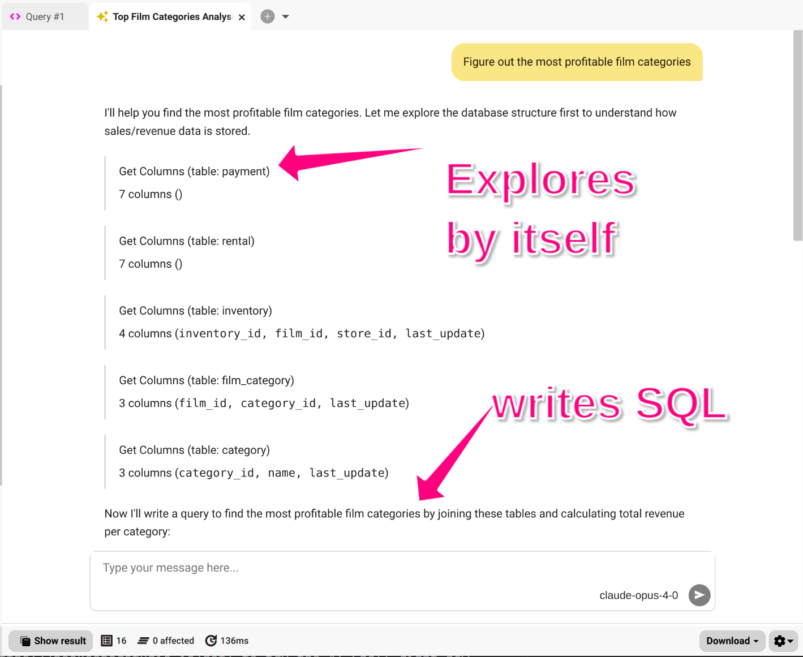
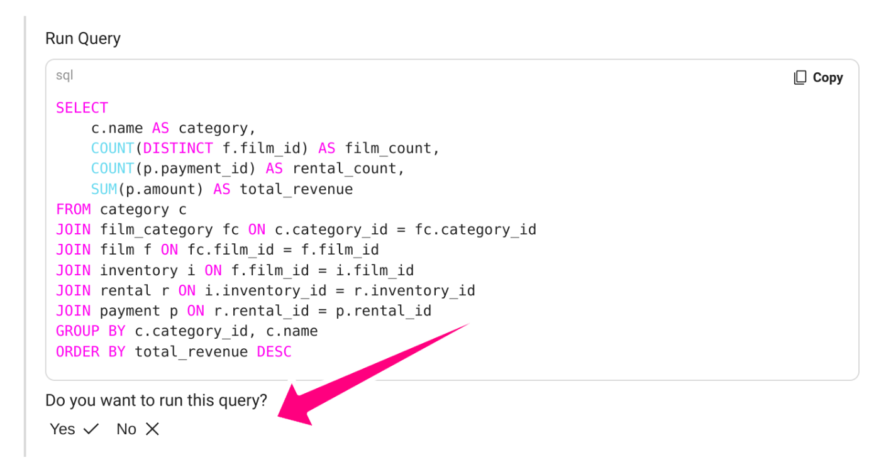

<!--
 -->



O AI Shell do Beekeeper Studio é modelado após [Claude Code](https://www.anthropic.com/claude-code) e [Aider](https://aider.chat/). É projetado para aumentar a produtividade de usuários técnicos (como você!).


## Codificação Profunda e Auto Aprendizado de IA

O AI Shell incorpora seu agente diretamente dentro do Beekeeper Studio. Tem consciência profunda de SQL e a habilidade de explorar esquemas, entender relações e restrições, e escrever e executar SQL (com permissão), diretamente dentro do app.

[Veja nosso website](https://beekeeperstudio.io/features/ai-sql) para vídeos, screenshots e mais.

## Como usar o AI Shell

1. Escolha seu provedor de IA de preferência (na beta apenas Anthropic está disponível)
2. Digite sua chave API
3. Faça perguntas
4. A IA explora seus dados
5. Obtenha resultados
6. Faça mais perguntas

## Preços do AI Shell

O AI Shell **está incluído em todas as versões pagas do Beekeeper Studio**, sem cobrança adicional. Note que você é responsável pelos custos incorridos com seu provedor de IA, já que o Beekeeper não age como intermediário de forma alguma.

Todos os downloads do Beekeeper Studio vêm com um teste gratuito de 14 dias, [baixe o Beekeeper Studio](https://beekeeperstudio.io/get) para experimentar o AI Shell agora mesmo.

## Ferramentas do AI Shell

Seu agente de IA tem acesso às seguintes ferramentas de dentro do Beekeeper Studio:

- [x] Listando esquemas, tabelas, views, funções e procedimentos
- [x] Visualizando relações e restrições de tabela
- [x] Olhando suas consultas salvas para orientação
- [x] Verificando suas abas abertas para orientação
- [x] Escrevendo e executando SQL (com permissão)


## Configuração do AI Shell

Você pode configurar o AI Shell usando o [sistema de configuração](./configuration.md) do Beekeeper Studio.



## Instruções Customizadas

Você pode fornecer instruções customizadas para personalizar como o AI Shell responde às suas mensagens. Para adicionar instruções customizadas:

1. Abra o menu de configurações (⚙️).
2. Vá para a aba General.
3. Adicione suas instruções customizadas no campo de texto fornecido

Suas instruções são anexadas às instruções base do AI Shell e são incluídas com **toda mensagem que você envia** como um prompt de sistema, garantindo comportamento consistente entre sessões.
Para detalhes, veja [o repositório de instruções](https://github.com/beekeeper-studio/bks-ai-shell/tree/main/instructions).


## Privacidade de Dados do AI Shell

O AI shell é 100% opcional. Mesmo quando em uso, nenhum dado é enviado do AI Shell para os servidores do Beekeeper Studio. O AI Shell se comunica diretamente com seu Agente de IA de escolha -- sem intermediários.

Para começar a usar o AI Shell você deve escolher seu agente e inserir uma chave API. Ao fazer isso, você está permitindo que o AI Shell do Beekeeper Studio se comunique com seu agente de IA escolhido.

### Informação Compartilhada Com O Agente

O AI Shell permite que seu agente explore o esquema dos seus dados, execute SQL e leia resultados. O AI Shell mostrará o que a IA vê conforme está trabalhando, nada é oculto da vista.

O AI shell enviará as seguintes informações para seu agente quando você usar o shell:

- Nomes de tabelas e nomes de colunas
- Estrutura de tabela, como relações e índices
- Consultas SQL executadas anteriormente
- Os resultados de consultas SQL aprovadas para execução (por você) dentro do AI Shell
- Quaisquer erros de execução de consulta que ocorram


### AI Shell pede permissão para executar SQL

O AI Shell pode executar consultas SQL, então ver os resultados dessas consultas. Esta é uma parte chave de como o shell navega ao redor do seu banco de dados para descobrir coisas.

Há algumas ações limitadas que o AI shell pode tomar sem sua permissão, mas sempre pedirá seu consentimento explícito ao executar SQL. Isso lhe dá a chance de revisar o código e rejeitá-lo sempre que tiver preocupações.



#### Permitir execução de consultas apenas de leitura sem pedir permissão

Se preferir não ser perguntado toda vez, pode habilitar `Always allow execution of read-only queries`:

1. Abra o menu Configurações (⚙️ no AI Shell).
2. Vá para a aba General.
3. Alterne **Always allow execution of read-only queries**.

### Desabilitando o AI Shell

Você pode desabilitar o AI shell inteiramente adicionando uma flag ao seu [arquivo de configuração](./configuration.md) pessoal ou de administrador para desabilitar o shell.



Mesmo se o usuário da aplicação inseriu anteriormente uma chave API, esta configuração desabilitará o recurso e bloqueará qualquer uso adicional.

## Solução de Problemas

### Problema buscando Ollama

Se o AI Shell não conseguir conectar ao Ollama, pode ser devido a **restrições CORS**. Você precisará permitir requests do Beekeeper Studio.

#### macOS

Execute um dos seguintes comandos:

```bash
# Permitir todas as origens
launchctl setenv OLLAMA_ORIGINS "*"

# Permitir apenas Beekeeper Studio
launchctl setenv OLLAMA_ORIGINS "plugin://*"
```

#### Windows

Defina uma variável de ambiente:

1. Pressione **Windows + R**, digite `sysdm.cpl`, e pressione **OK**.
2. Vá para **Advanced > Environment Variables**.
3. Adicione ou edite a variável `OLLAMA_ORIGINS`.
4. Defina o valor para:

   * `*` (permitir todas as origens), ou
   * `plugin://*` (apenas Beekeeper Studio).

#### Linux

Edite a configuração do serviço Ollama:

```bash
sudo systemctl edit ollama.service
```

Adicione a variável de ambiente:

```
[Service]
Environment="OLLAMA_ORIGINS=*"
# ou
Environment="OLLAMA_ORIGINS=plugin://*"
```

Então reinicie o serviço:

```bash
sudo systemctl restart ollama
```