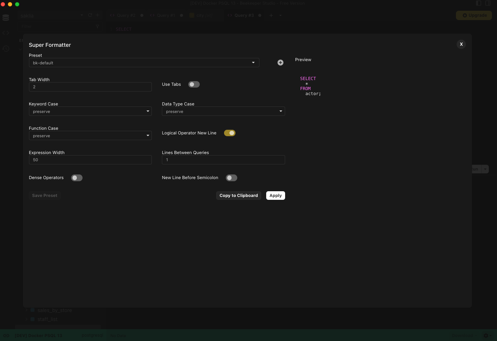
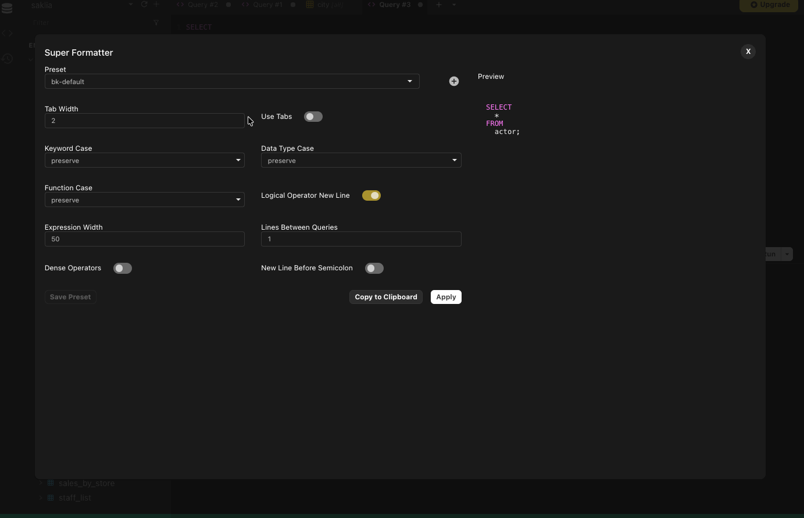
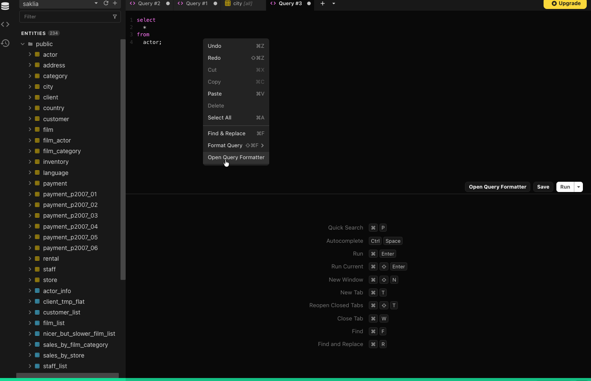
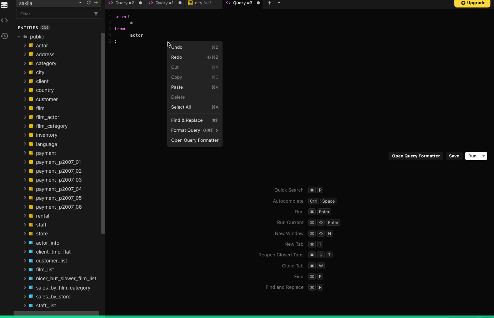

The Beekeeper SQL Query Formatter is a great way to ensure your SQL meets strict formatting requirements either from your boss or just yourself. The SQL Query Formatter brings the options of the [SQL Formatter NPM Package](https://www.npmjs.com/package/sql-formatter) to your fingertips to set, save, and use formatting presets.

## Getting Started

Right click on the editor window and select **Open Query Formatter** or click the button next to **Save** and **Run** to open the formatter. From there, you can select and update any of the presets available.



### Built-in Presets
1. bk-default (default)
2. pgFormatter
3. prettier-sql

### Update Default Preset
You can set the default formatter for your queries using the Beekeeper Studio [configuration system](./configuration.md). Out of the box this will be **bk-default**.

```ini
[ui.queryEditor]
defaultFormatter = bk-default
```

## How to Format Queries



1. Open the SQL Query Formatter
2. Select a preset from the dropdown to use as a base
3. Select options and ensure settings are as you want from the preview to the right
4. Click Apply

*Note, applying doesn't save these settings to the selected preset.*


## How to Save a Preset

Follow the instructions for formatting a query, but instead of clicking **Apply**, click **Save Preset**

*Note: Saving doesn't automatically apply the updates. Click Apply for the settings to be applied to your query.*

## Creating a New Preset



1. Open the SQL Query Formatter
2. Select a preset from the dropdown to use as a base
3. Click the + button next to the presets dropdown
4. Enter a name for the format (must be a unique name)
5. Select options and ensure settings are as you want from the preview to the right
6. Click **Save Preset**

*Note: To apply the preset to your SQL, click Apply.*

## Delete a Preset

1. Open the SQL Query Formatter
2. Select the preset from the dropdown that you want to delete
3. Click the **Delete Config** button next

*Note: The 3 built-in presets cannot be deleted. They can be edited though.*

## Format Queries Using Presets



1. Right click in your editor window
2. Hover over **Format Query**
3. Select a preset from your saved presets.

