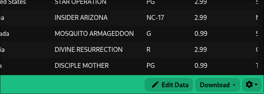
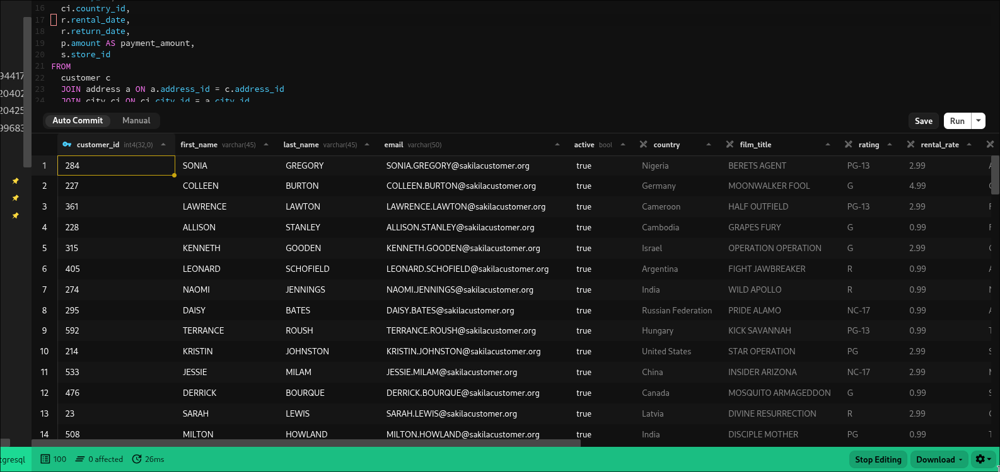
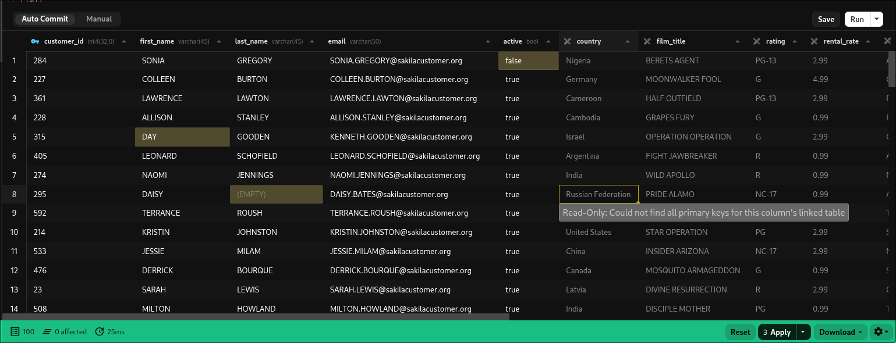

Click the `Edit Data` button in the bottom right corner to enter edit mode.

Upon entering edit mode, extra information is fetched for the columns in your query, including data types and primary key information.

You can edit across multiple joins with tables and columns that are aliased, as long as all primary keys are in the result set, we should be able to generate the update script

## How it works
When you click `Edit Data` Beekeeper analyzes your query to determine the output columns and the tables used in the Select statement. It then maps those output columns back to the source columns from your tables to gather information like the data type, what primary keys are on the table, etc. This information allows us to determine whether or not we will be able to write an update query for that column
