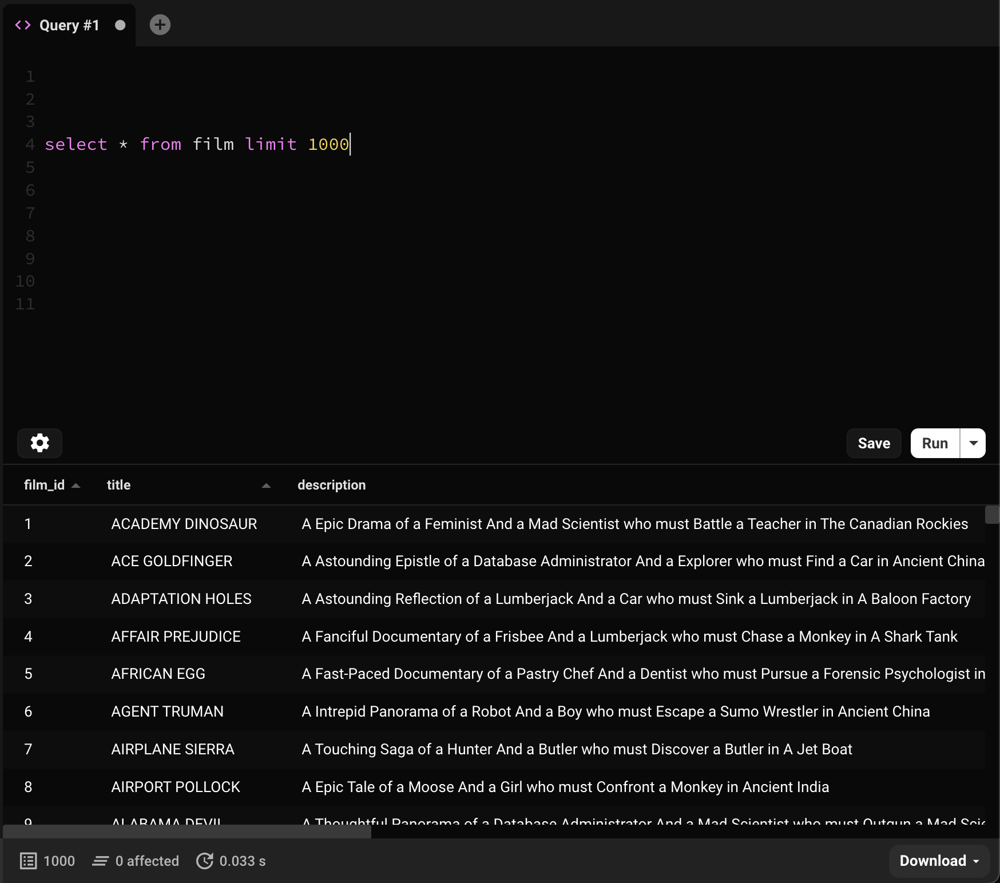
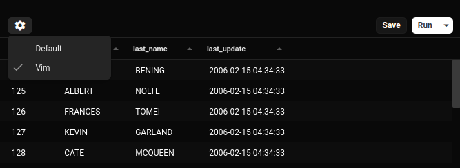

Escribir SQL es una parte tan fundamental de interactuar con una base de datos relacional que pusimos esta funcionalidad en primer plano.

Puedes usar la pestana de consulta SQL para escribir y ejecutar consultas SQL de forma rapida y facil.

## Autocompletado de codigo

Hemos intentado hacer que nuestro autocompletado sea util pero no intrusivo.

Las sugerencias de codigo apareceran automaticamente en las siguientes situaciones:

- `tablas` seran sugeridas despues de escribir `from` o `join`
- `columnas` seran sugeridas despues de escribir un nombre de tabla, o alias de tabla, seguido de un punto, ej `film.`

En estas situaciones, Beekeeper resolvera automaticamente los nombres correctos de tabla y columna para la entidad que estas consultando.

### Activar autocompletado manualmente

La combinacion de teclas predeterminada para activar manualmente el autocompletado es `Ctrl+Space`.


## Contextos de ejecucion

Si te gusta escribir scripts SQL largos con multiples consultas en el mismo panel del editor (se que a mi si), puede que quieras ejecutar solo una parte de tu script a la vez.

Beekeeper te permite:

1. Ejecutar todo (esto es lo predeterminado)
2. Ejecutar solo la consulta 'actual' (Beekeeper resalta esta consulta para que sepas que se ejecutara)
3. Ejecutar solo lo que hayas seleccionado.


## Gestion de transacciones

Las transacciones ejecutadas dentro del editor de consultas seran detectadas automaticamente por Beekeeper, que luego reservara una conexion para tu pestana de consulta actual hasta que esa transaccion sea confirmada o revertida.

Tambien hay un [Modo de transaccion manual](./manual-transaction-management.md) que te permite manejar manualmente cada paso de este proceso.

Esta funcionalidad actualmente solo esta disponible para Postgres, CockroachDB, Redshift, MySQL, MariaDB, SQLServer, Firebird y Oracle.

## Parametros de consulta

Puedes parametrizar tus consultas y Beekeeper te pedira valores cuando la ejecutes.

Puedes usar tres tipos de sintaxis `:variable`, `$1` o `?` dependiendo del motor de base de datos que estes consultando.

```sql
select * from table where foo = :one and bar = :two

select * from table where foo = $1 and bar = $2
```


Puedes configurar que sintaxis esta activa para tu motor de base de datos usando el [archivo de configuracion](../configuration.md).

```ini
; Habilitar todos los tipos de parametros para postgres (no recomendado)
[db.postgres.paramTypes]
positional = true
named[] = ':'
named[] = '@'
named[] = '$'
numbered[] = '?'
numbered[] = ':'
numbered[] = '$'
quoted[] = ':'
quoted[] = '@'
quoted[] = '$'
```


## Descargar resultados

Cuando ejecutas una consulta, los resultados apareceran justo debajo del editor SQL, simple!



Si ejecutas multiples consultas SQL, puedes seleccionar diferentes conjuntos de resultados con el menu desplegable en la barra de estado. Obtendras una pequena ventana emergente informandote la primera vez que lo hagas.

### Conjuntos de resultados grandes

Si ejecutas una consulta que genera un conjunto de resultados de mas de 50,000 registros, Beekeeper truncara la tabla de resultados (para conservar memoria).

En la edicion comercial de Beekeeper Studio, tambien puedes seleccionar `Ejecutar a archivo`, esto ejecutara tu consulta SQL y enviara los resultados completos directamente a un archivo CSV.

## Modo Vim
Junto con el editor de consultas predeterminado, Beekeeper soporta el modo Vim, que te permite escribir consultas en un editor de texto tipo Vim.

Para habilitar esto, puedes hacer clic en el engranaje en la esquina inferior izquierda del editor de consultas:



Y luego estas listo para usar un editor vim en Beekeeper!

El editor que prefieras se preservara en todas las conexiones/reinicios/etc.

### Personalizacion
Tambien puedes agregar tus propios atajos de teclado y movimientos al editor vim colocando un archivo `.beekeeper.vimrc` en el `userDirectory` de Beekeeper Studio y escribiendo tus mapeos personalizados.

Ubicaciones de `userDirectory`:
- Windows: `%APPDATA%\beekeeper-studio`
- Linux: `~/.config/beekeeper-studio`
- MacOS: `~/Library/Application Support/beekeeper-studio`

Por ejemplo, si eres usuario de Helix, puedes agregar comandos `gl` y `gh` asi:

```
nmap gl $
nmap gh ^
```

Estos comandos agregan movimientos para `gl` para ir al final de una linea, y `gh` para ir al inicio de una linea

Actualmente solo soportamos los comandos `nmap`, `imap` y `vmap`, pero esperamos introducir mas en el futuro!
