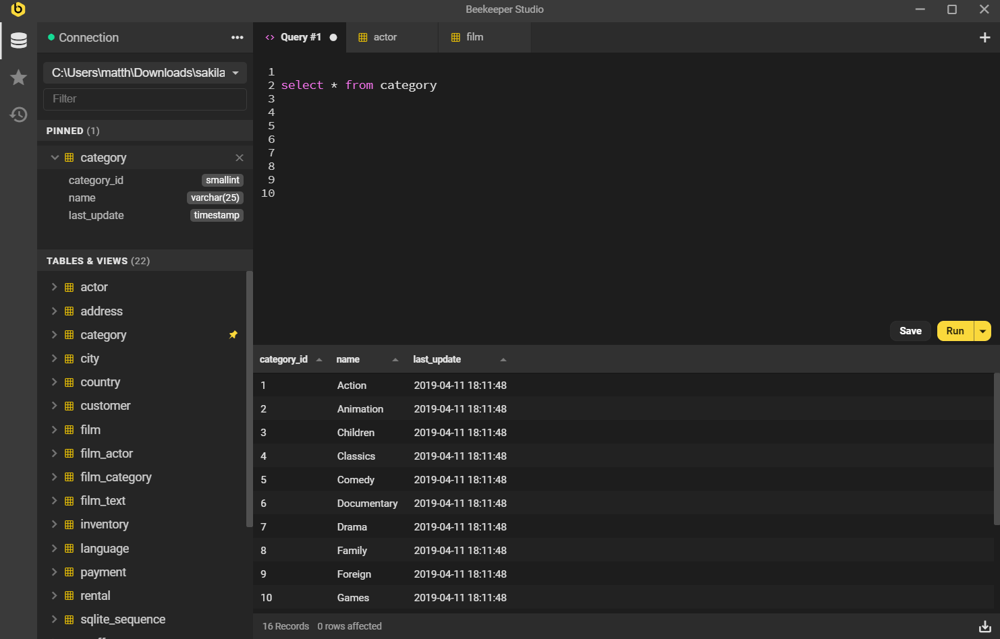
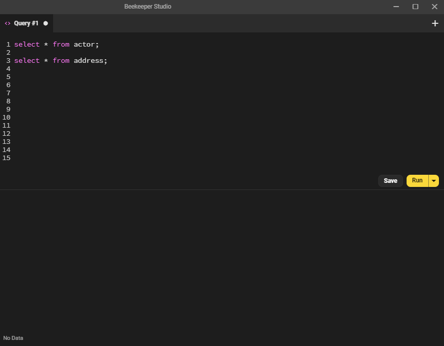
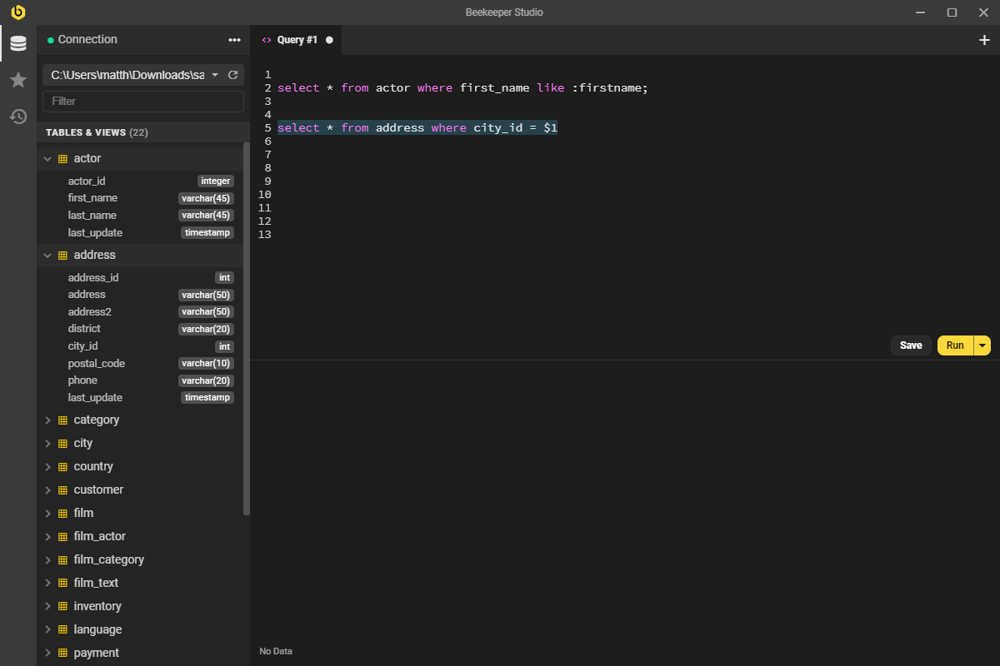
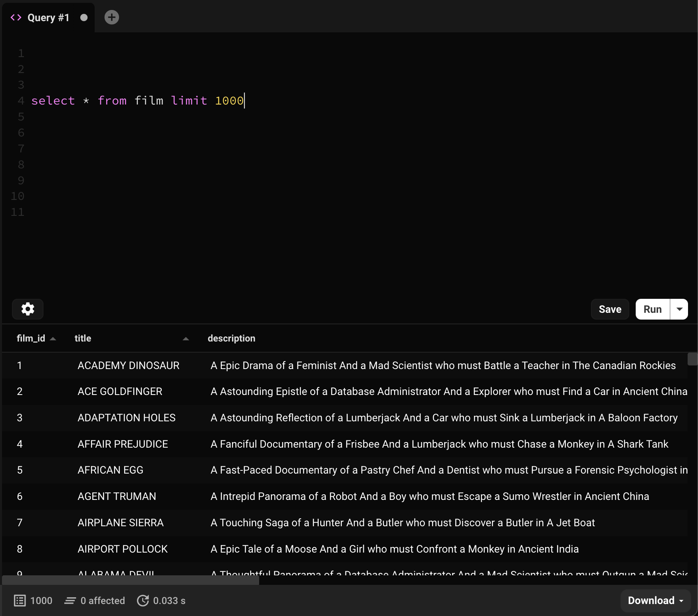
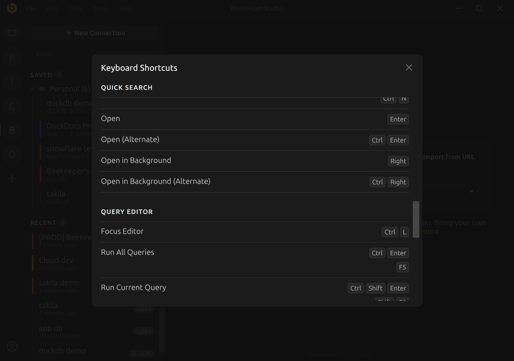
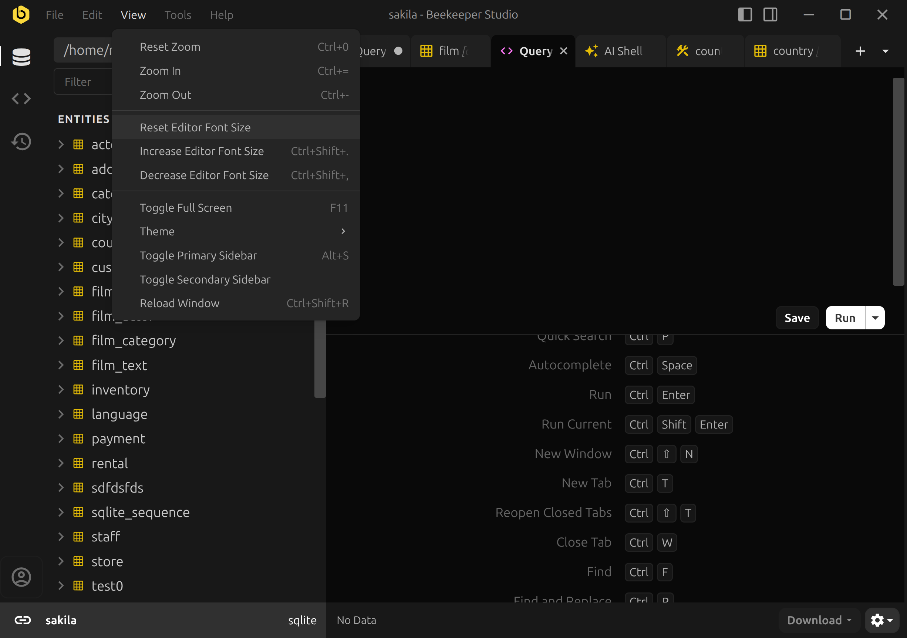
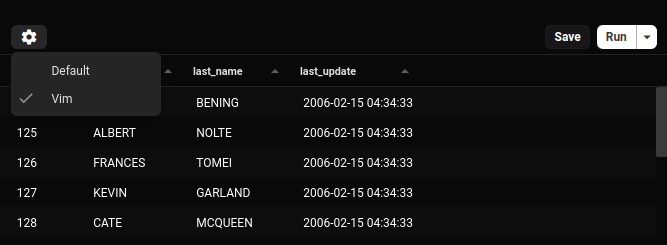

Escribir SQL es una parte tan fundamental de interactuar con una base de datos relacional que pusimos esta funcionalidad en primer plano.

Puedes usar la pestana de consulta SQL para escribir y ejecutar consultas SQL de forma rapida y facil.

## Autocompletado de codigo

Hemos intentado hacer que nuestro autocompletado sea util pero no intrusivo.

Las sugerencias de codigo apareceran automaticamente en las siguientes situaciones:

- `tablas` seran sugeridas despues de escribir `from` o `join`
- `columnas` seran sugeridas despues de escribir un nombre de tabla, o alias de tabla, seguido de un punto, ej `film.`

En estas situaciones, Beekeeper resolvera automaticamente los nombres correctos de tabla y columna para la entidad que estas consultando.

### Activar autocompletado manualmente

La combinacion de teclas predeterminada para activar manualmente el autocompletado es `Ctrl+Space`.



## Contextos de ejecucion

Si te gusta escribir scripts SQL largos con multiples consultas en el mismo panel del editor (se que a mi si), puede que quieras ejecutar solo una parte de tu script a la vez.

Beekeeper te permite:

1. Ejecutar todo (esto es lo predeterminado)
2. Ejecutar solo la consulta 'actual' (Beekeeper resalta esta consulta para que sepas que se ejecutara)
3. Ejecutar solo lo que hayas seleccionado.



## Gestion de transacciones

Las transacciones ejecutadas dentro del editor de consultas seran detectadas automaticamente por Beekeeper, que luego reservara una conexion para tu pestana de consulta actual hasta que esa transaccion sea confirmada o revertida.

Tambien hay un [Modo de transaccion manual](./manual-transaction-management.md) que te permite manejar manualmente cada paso de este proceso.

Esta funcionalidad actualmente solo esta disponible para Postgres, CockroachDB, Redshift, MySQL, MariaDB, SQLServer, Firebird y Oracle.

## Parametros de consulta

Puedes parametrizar tus consultas y Beekeeper te pedira valores cuando la ejecutes.

Puedes usar tres tipos de sintaxis `:variable`, `$1` o `?` dependiendo del motor de base de datos que estes consultando.

```sql
select * from table where foo = :one and bar = :two

select * from table where foo = $1 and bar = $2
```


Puedes configurar que sintaxis esta activa para tu motor de base de datos usando el [archivo de configuracion](../configuration.md).

```ini
; Habilitar todos los tipos de parametros para postgres (no recomendado)
[db.postgres.paramTypes]
positional = true
named[] = ':'
named[] = '@'
named[] = '$'
numbered[] = '?'
numbered[] = ':'
numbered[] = '$'
quoted[] = ':'
quoted[] = '@'
quoted[] = '$'
```


## Descargar resultados

Cuando ejecutas una consulta, los resultados apareceran justo debajo del editor SQL, simple!



Si ejecutas multiples consultas SQL, puedes seleccionar diferentes conjuntos de resultados con el menu desplegable en la barra de estado. Obtendras una pequena ventana emergente informandote la primera vez que lo hagas.

### Conjuntos de resultados grandes

Si ejecutas una consulta que genera un conjunto de resultados de mas de 50,000 registros, Beekeeper truncara la tabla de resultados (para conservar memoria).

En la edicion comercial de Beekeeper Studio, tambien puedes seleccionar `Ejecutar a archivo`, esto ejecutara tu consulta SQL y enviara los resultados completos directamente a un archivo CSV.

## Atajos de teclado

Beekeeper Studio tiene una referencia de atajos de teclado integrada. Abrela desde el menu `Help` para ver todos los atajos disponibles organizados por categoria.



## Tamano de fuente del editor

Puedes ajustar el tamano de fuente del editor SQL desde el menu `View`:

- **Aumentar tamano de fuente del editor** - `Ctrl+Shift+.`
- **Disminuir tamano de fuente del editor** - `Ctrl+Shift+,`
- **Restablecer tamano de fuente del editor** - restaura el tamano predeterminado



## Modo Vim
Junto con el editor de consultas predeterminado, Beekeeper soporta el modo Vim, que te permite escribir consultas en un editor de texto tipo Vim.

Para habilitar esto, puedes hacer clic en el engranaje en la esquina inferior derecha del editor de consultas:



Y luego estas listo para usar un editor vim en Beekeeper!

El editor que prefieras se preservara en todas las conexiones/reinicios/etc.

### La linea de estado

En modo vim el editor muestra una linea de estado en la parte inferior con el
modo actual, las teclas pendientes de completar un comando y el prefijo de
repeticion. Tambien es donde se escriben los comandos `:` y las busquedas `/`.

### Comandos ex

| Comando | Efecto |
| --- | --- |
| `:w`, `:write` | Guarda la consulta actual |
| `:q`, `:quit` | Cierra la pestana actual |
| `:qa` | Cierra todas las pestanas |
| `:x`, `:wq` | Guarda y luego cierra la pestana |
| `:tabnew [nombre]` | Abre una pestana nueva, opcionalmente con nombre |

Actuan sobre la pestana en la que estas escribiendo.

### Cancelar una consulta en ejecucion

`Esc` cancela una consulta en ejecucion. En modo vim solo lo hace desde el modo
normal y sin nada pendiente, de forma que salir del modo insercion o visual
sigue funcionando como corresponde. `Ctrl-Esc` cancela una consulta desde
cualquier modo.

### Ctrl+P

Vim asigna `Ctrl+P` a "subir" en todos los modos. En Beekeeper Studio se
mantiene en la busqueda rapida, ya que `k` tambien sube. Para recuperarlo,
agrega `nnoremap <C-p> k` a tu `.beekeeper.vimrc`.

### Personalizacion
Tambien puedes agregar tus propios atajos de teclado y movimientos al editor vim colocando un archivo `.beekeeper.vimrc` en el `userDirectory` de Beekeeper Studio y escribiendo tus mapeos personalizados.

Ubicaciones de `userDirectory`:
- Windows: `%APPDATA%\beekeeper-studio`
- Linux: `~/.config/beekeeper-studio`
- MacOS: `~/Library/Application Support/beekeeper-studio`

Por ejemplo, si eres usuario de Helix, puedes agregar comandos `gl` y `gh` asi:

```
nmap gl $
nmap gh ^
```

Estos comandos agregan movimientos para `gl` para ir al final de una linea, y `gh` para ir al inicio de una linea

Las lineas que empiezan con `"` son comentarios, y las lineas vacias se
ignoran. Comandos soportados:

| Comando | Notas |
| --- | --- |
| `map`, `nmap`, `imap`, `vmap` | Mapeos recursivos |
| `noremap`, `nnoremap`, `inoremap`, `vnoremap` | Mapeos no recursivos |
| `unmap`, `nunmap`, `iunmap`, `vunmap` | Elimina un mapeo |
| `mapclear`, `nmapclear`, `imapclear`, `vmapclear` | Elimina todos los mapeos propios |
| `set` | Opciones de vim, por ejemplo `set ignorecase`, `set nonumber`, `set tabstop=4` |
| `let mapleader` | A que se expande `<leader>`. Por defecto `\` |

Lo que no se pueda interpretar se informa en una notificacion que indica la
linea, y el resto del archivo se sigue aplicando.

#### Copiar al portapapeles del sistema

El registro `*` esta conectado al portapapeles del sistema, asi que `"*y` y
`"*p` funcionan como en vim. Para que una `y` sola lo use, el mapeo tiene que
ser no recursivo:

```
nnoremap y "*y
```

Escrito como `nmap y "*y`, la `y` de la derecha se vuelve a expandir en el
propio mapeo, sin fin. Ese caso se informa como error en lugar de aplicarse.
