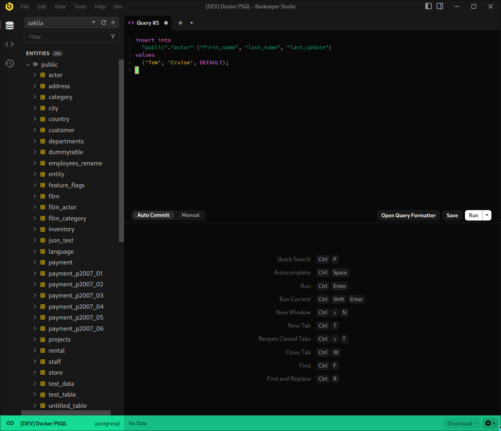
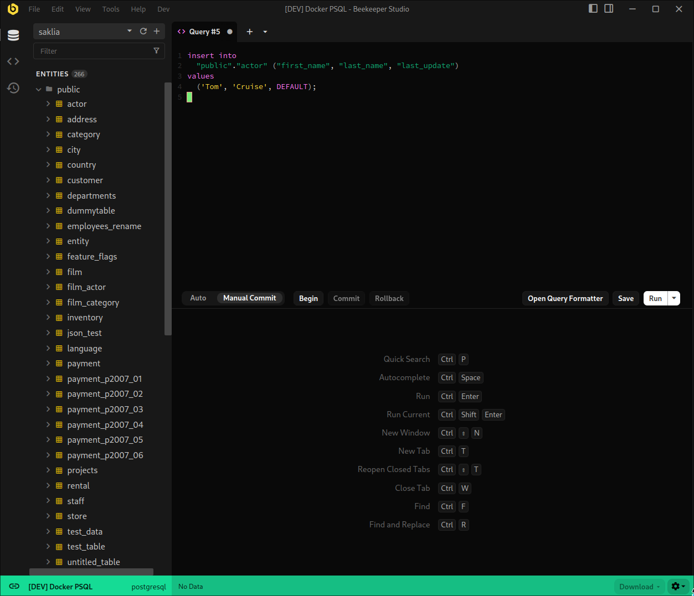
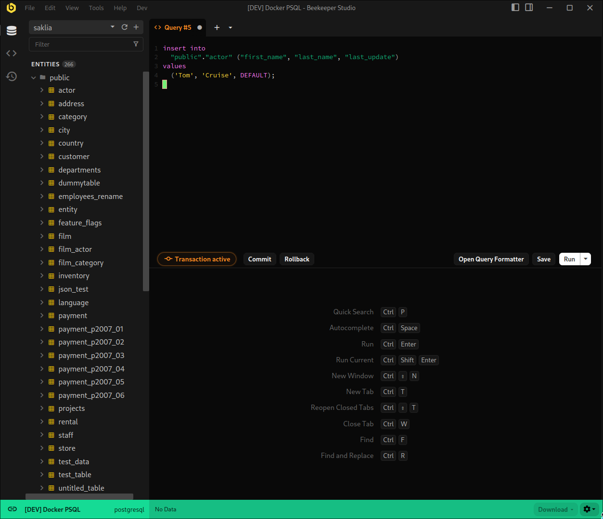

El modo de transaccion manual de Beekeeper te permite asegurar que tienes control total sobre cuando se confirman las transacciones, mientras tambien te asegura que no dejes ninguna transaccion abierta por accidente.

Encontraras esta opcion en la parte inferior izquierda del Editor SQL



## Iniciar transaccion
Una vez que hayas entrado en este modo, cada consulta estara dentro de una transaccion y debe ser confirmada o revertida para que esos cambios se reflejen en tu base de datos. Puedes iniciar una transaccion haciendo clic en el boton `Iniciar` en la parte inferior izquierda del editor, o simplemente ejecutando una consulta, en cuyo caso Beekeeper automaticamente antepondra una declaracion begin a tu consulta.



## Transacciones activas
Cuando una transaccion comienza, reservamos una conexion para esa pestana para que no se pierda ningun contexto, y tendras acceso a los botones `Confirmar` y `Revertir`. Como precaucion, tambien hay un tiempo de espera establecido para todas las transacciones. El valor predeterminado es 10 minutos, con un periodo de advertencia de 1 minuto. Esto significa que por defecto, despues de 9 minutos seras notificado de que una transaccion todavia esta abierta, y se te dira que termines la transaccion o la mantengas viva por otros 10 minutos.



## Configuracion
Puedes cambiar algunos de los valores predeterminados para este sistema usando el [archivo de configuracion](../configuration.md) (para cada base de datos, o solo para un sistema de base de datos especifico).

```ini
[db.default]
; Numero maximo de transacciones manuales a permitir a la vez
; Esto debe mantenerse por debajo del tamano maximo del pool para la base de datos, ya que estas conexiones
; se extraen de ese pool
maxReservedConnections = 2 ; Permitir dos transacciones activas a la vez
; Cuanto tiempo mantener una transaccion abierta sin ninguna actividad antes de revertirla automaticamente en modo commit manual
manualTransactionTimeout = 600000 ; 10 Minutos
; La cantidad de tiempo antes de una reversion automatica para advertir al usuario que esta a punto de suceder
autoRollbackWarningWindow = 60000 ; 1 Minuto

[db.postgres]
maxReservedConnections = 4 ; Permitir 4 transacciones activas a la vez (solo para postgres)
```

Esta funcionalidad actualmente solo esta disponible para Postgres, CockroachDB, Redshift, MySQL, MariaDB, SQLServer, Firebird y Oracle.
