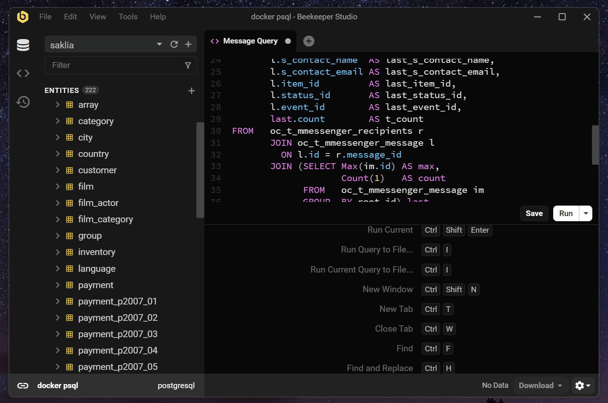
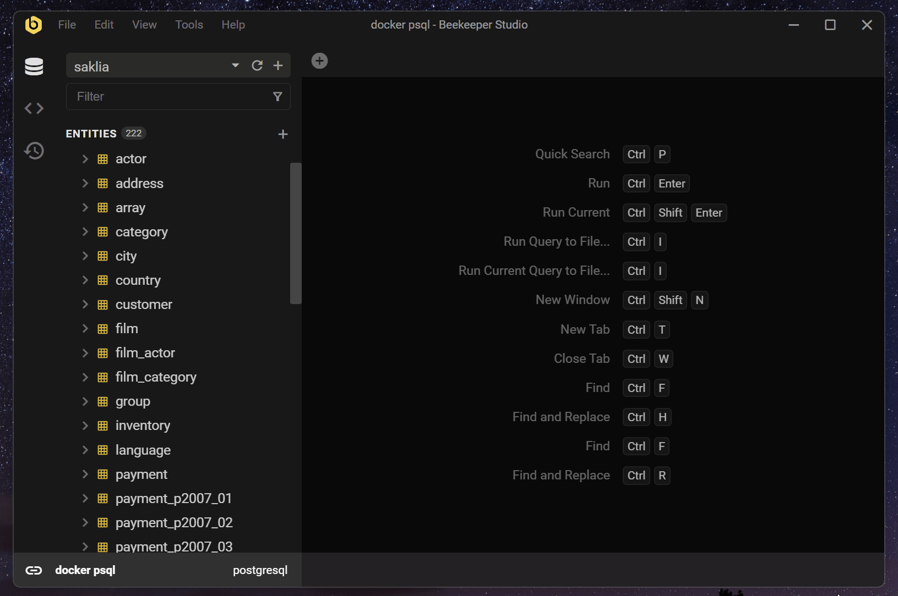
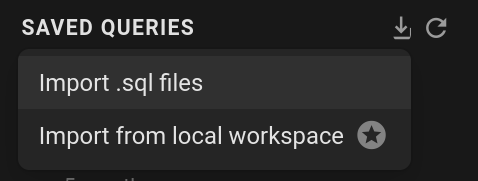
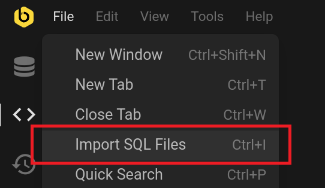

A veces tenemos consultas que usamos repetitivamente. Para evitar perder nuestras consultas SQL, podemos guardarlas en un archivo o usar el panel de Consultas guardadas.

## Guardar una consulta

Puedes guardar una consulta presionando `Ctrl+S` o haciendo clic en el boton `Guardar` en la parte inferior derecha del Editor de consultas.

Despues de eso, puedes escribir el nombre de la consulta (puedes renombrarla despues), y luego hacer clic en `Guardar`.

## Abrir las consultas guardadas

Puedes abrir el panel de Consultas guardadas haciendo clic en el icono de Consultas guardadas en la barra lateral. Despues de eso, abre la consulta con doble clic.

## Importar archivos SQL

Para importar archivos de consulta, puedes hacer clic en el boton de importar, y luego hacer clic en `Importar archivos .sql`. O hacer clic en `Archivo > Importar archivos SQL`. Acepta multiples archivos de `.sql` o cualquier formato de archivo de texto. Ten en cuenta que esto hara una copia de tu archivo a tus Consultas guardadas. Cualquier cambio de los archivos originales no se reflejara en Beekeeper Studio.

## Donde guarda Beekeeper Studio mis consultas SQL?

Cuando guardas consultas SQL en Beekeeper Studio, se persisten en una base de datos SQLite en tu directorio de configuracion local. Por favor consulta [Ubicacion de almacenamiento de datos](../../support/data-location.md) para mas detalles.
