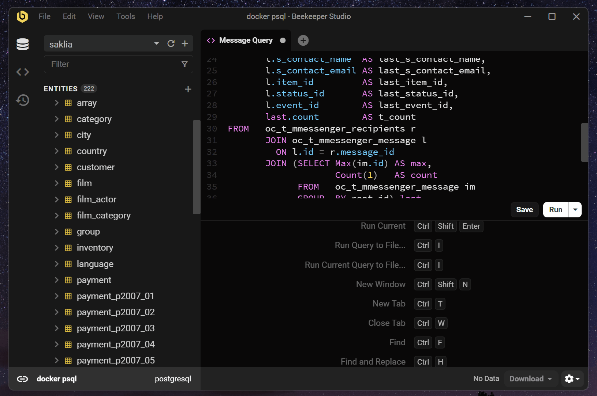
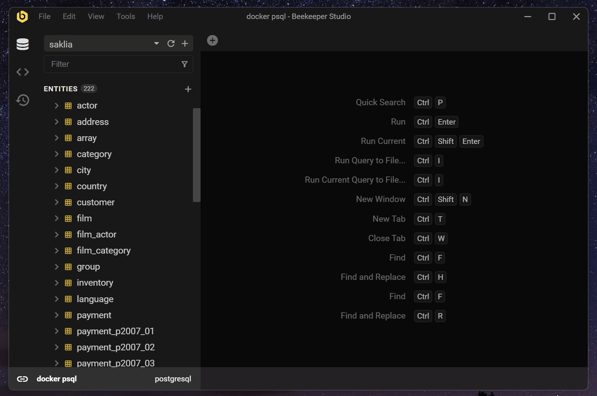
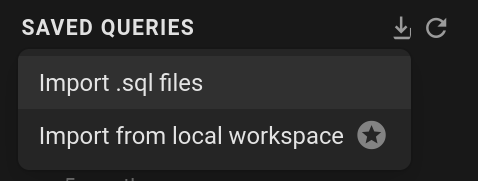
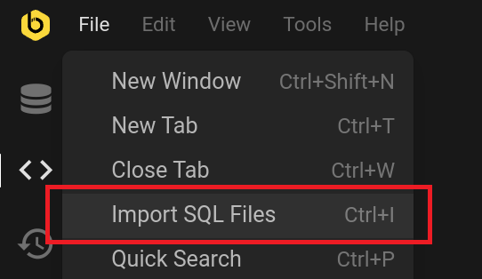

Sometimes we have queries that we use repetitively. To avoid losing our SQL queries, we can save them to a file, or use the Saved Queries panel.

## Save a query

You can save a query by pressing `Ctrl+S` or clicking the `Save` button at the bottom right of the Query Editor.

After that, you can type the name of the query (you can rename it later), and then click `Save`.

## Auto save

Once a query has been saved, an `Auto Save` toggle appears next to the `Save` button in the Query Editor. Enable it and your edits to that query are persisted automatically as you type, so there's no need to keep pressing `Ctrl+S`. The toggle is set per query and remembered across sessions, and only applies to queries that have already been saved — new, unnamed queries still go through the save dialog so you can name them first.

## Open the saved queries

You can open the Saved Queries panel by clicking the Saved Queries icon at the sidebar. After that, open the query with double click.

## Import SQL files

To import query files, you can click the import button, and then click `Import .sql files`. Or click `File > Import SQL Files`. It accepts multiple files of `.sql` or any text file format. Be aware that this will make a copy of your file to your Saved Queries. Any changes from the original files will not be reflected in Beekeepe Studio.

## Where does Beekeeper Studio save my SQL Queries?

When you save SQL queries in Beekeeper Studio they are persisted to a SQLite database in your local configuration directory. Please see [Data Storage Location](../../support/data-location.md) for more details.
